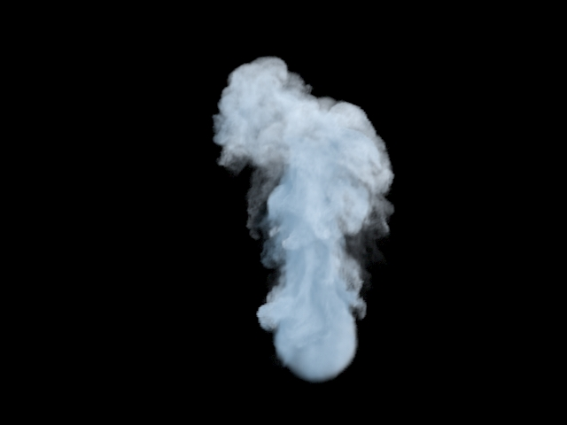

#Rendering Volumes from Houdini in Pixar's RenderMan – Part 1
I've recently built a set of tools that allow rendering Houdini's volumes as true volume primitives in prman using an ImplicitField DSO.

##About the tools
* F3DImplicitField is an ImplicitField DSO which uses Sony's Field3D C++ API along with prman's SDK to render "level set" surfaces.
* f3d2prman is a C++ procedural runprogram that outputs RIB necessary for rendering an RiVolume primitive. This is employed as a Geometry SHOP HDA in Houdini.
* HDA UI
* A set of RSL shaders for rendering smoke, fire, and explosions.

Side Effects provides a Field3D plugin with Houdini's HDK, which is necessary to both import and export volumes as Field3D voxel grids.

##Features
* Both Sparse and Dense Fields are supported.
* For now, I assume density and all additional fields like temperature, heat, etc. are scalar.
* Velocity fields can be either vector or scalar.
* Scalar fields are extracted from the Field3D file, and injected into the RIB snippet that calls the ImplicitField plugin. The runprogram and implicit work together in this regard. In other words, field names like "burn", "heat", etc. are not hard coded, and can easily be added as AOV's, or take part in shader calculations.
* The API's and prman itself handle multi-threading, so it goes without saying this is multi-threaded.
* Deformation Motion Blur is supported, with various controls exposed to increase / decrease the amount of blur, and the bounding box size among others.

Here's an example render. There will definitely be more to come, including a more thorough overview showing some motion blur with animation.

###Comparison between Mantra and PRman.
Mantra

PRman

##Sources
* The guys at Sony have done a great job providing documentation and valuable examples bundled with the Field3D library. The SIGGRAPH 2011 class on Production Volume Rendering also provides almost 300 pages of volume rendering material. This is going to be released as a book Sept. 28th 2012.

* Besides documentation directly related to Field3D, I also found helpful information from Physically Based Rendering, and Graphics Gems IV and V.

* PBRT implements volume scattering in chapter 11, which outlines a lot of details similar to what we're doing in an ImplicitField plugin. A portion of this chapter deals with 3D voxel grids, and how to sample densities at positions between sample points. (interpolation).

* The Graphics Gems books detail the algorithms commonly used for interpolating between sample points in 3D space. Graphics Gems IV, page 521 discusses Tri-linear interpolation (chapter by Steve Hill), and Graphics Gems V, page 107 (chapter by Louis K. Arata) discusses Tricubic interpolation. Field3D supports both of these algorithms out of the box, so further reading isn't essential, but it's good to know what tools you'll be using. Their strengths, weaknesses, etc.

* The next item on my TODO list is the shader for explosions. I'll post more when I have something to show.
