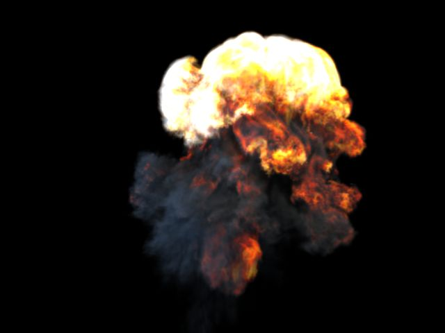

# Field3D ImplicitField DSO for prman – motionblur

[motionblur test](http://vimeo.com/48715434)

This is a continuation from my previous posts regarding the rendering of volumes from Houdini in prman.

This is a short test with velocity driven motionblur, computed internally within my DSO.

The result should be more pronounced compared to previous test I posted on vimeo, which I removed. (you didn't miss much) I made a mistake in the way I handle scalar velocity fields, which led to incorrect data being presented to prman for the Y and Z axes. That's been solved, but I'm still not entirely happy with the result. It may be the resolution of my voxel grid, but I'm not pleased with the "streaky" look the blur has. It may also be alleviated with different shutter timing, and lower shading rate. More experimentation will follow.
